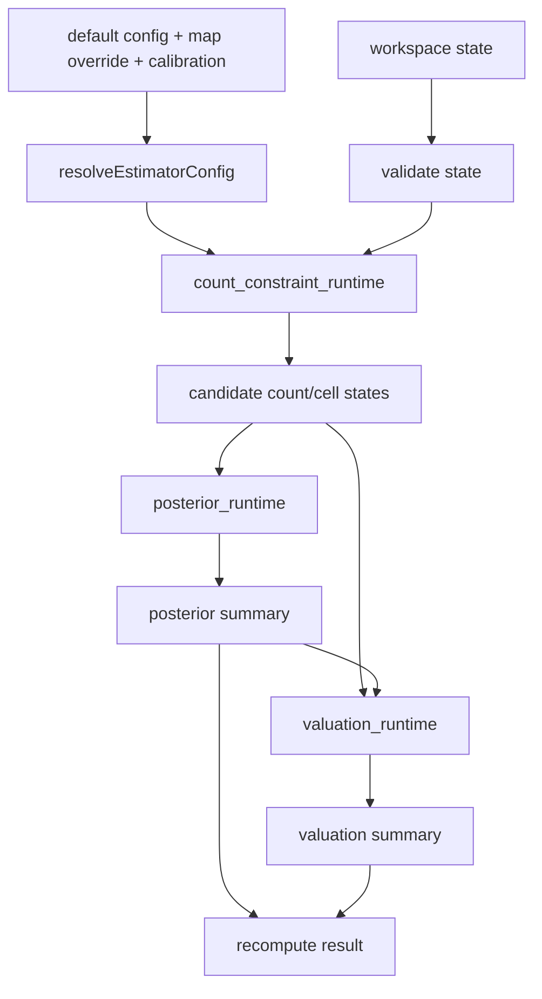

# Estimator Pipeline Refactor Design

## Goal

Refactor the Auction King estimator pipeline so the main solver flow is easier to audit, test, and tune without changing public default weights or authority gates.

This is a structure-first refactor. It must preserve existing runtime behavior and keep all default parameter updates fail-closed until source-owned replay and authority gates explicitly allow promotion.

## Current State

The project already has a strong source-owned research chain:

- `config/default/` owns default source sections.
- `src/core/default_config_bundle.js` is generated from those sections.
- `data/source_packages/authority_source_package.json` and `config/default/calibration.json` own catalog-backed calibration.
- `docs/research/` contains public curated evidence and fail-closed gate reports.
- `tests/` covers the estimator, replay builders, BidKing gates, UI behavior, and static release checks.

The main weakness is concentration of algorithm responsibility inside `src/core/estimator.js`. It currently owns config resolution, average-display semantics, count-state enumeration, posterior normalization, red type inference, collection-family phase stubs, value simulation, and the final `recompute()` orchestration.

That makes future parameter tuning harder to review because algorithm changes and parameter changes are too easy to mix.

## Authority Constraints

The first refactor stage must not change any authority-owned business state:

- Do not change `alpha_counts`.
- Do not change `cells_per_item`.
- Do not change `value_model`.
- Do not change `red_type_profiles`.
- Do not change calibration adoption status.
- Do not set `default_config_update_allowed=true`.
- Do not loosen `promotion_allowed` gates.
- Do not infer authority from BidKing reverse-engineering artifacts.

Current blockers remain source-owned:

- `calibration.quality_status.alpha_counts` is `fallback_only`.
- `data/battle_samples/authority_battle_samples.json` has no authority battle samples.
- Manual confirmation handoff gates are blocked until accepted human-confirmed samples exist.
- BidKing default adoption remains blocked on missing source-backed item `1106013`.

## Proposed Modules

### `src/core/average_observation_runtime.js`

Own average display and average-total feasibility rules.

Responsibilities:

- Normalize raw average display text.
- Preserve the difference between compact and fixed-width average input, for example `0.3` versus `0.30`.
- Resolve truncate/round semantics from solver config and field metadata.
- Compute feasible total-cell intervals for `(average, count)`.
- Build relaxed sparse-average support when configured.

Initial functions should be moved from `estimator.js` only after equivalence tests exist. Existing `src/core/avg_probability_core.js` should be reused where possible instead of duplicating math.

### `src/core/count_constraint_runtime.js`

Own count-state and cell-state constraints.

Responsibilities:

- Validate integer count fields.
- Resolve fixed count anchors and custom min/max bounds.
- Enumerate quality count states.
- Apply total item, total cell, quality total cell, green-white total, and orange/red bounds.
- Keep count prior scoring callable without requiring the full estimator class.

This module should not own valuation or UI output formatting.

### `src/core/posterior_runtime.js`

Own posterior mass operations and summaries.

Responsibilities:

- Normalize weighted candidates.
- Normalize posterior mass maps.
- Summarize count distributions and confidence.
- Accumulate convolved total-cell mass.
- Produce stable bucket summaries consumed by UI and replay reports.

This module is pure data transformation and should not read files, mutate config, or create random samples.

### `src/core/valuation_runtime.js`

Own valuation simulation.

Responsibilities:

- Apply custom quality value overrides.
- Resolve red type posterior mixtures.
- Run Monte Carlo value simulation using explicit solver budget.
- Keep red-tail uplift behavior equivalent to current output.
- Return valuation payloads consumed by `result_panel_runtime.js`.

Randomness must remain bounded by existing solver caps. No live or external side effects are allowed.

### `src/core/estimator.js`

Become the orchestrator.

Responsibilities:

- Resolve config for selected map.
- Validate state.
- Call count constraint, posterior, and valuation modules.
- Preserve public `AuctionKingEstimator` and `recompute()` API.
- Export compatibility helpers required by tests and scripts until downstream consumers are migrated.

The orchestrator can remain class-based during phase 1. Removing the class is out of scope.

## Data Flow

## Tuning Strategy

Parameter tuning remains shadow-only in this phase.

The refactor should make these later actions easier, but not perform them directly:

- Run count prior search via `src/core/count_prior_tuner.js`.
- Compare shadow candidates through settlement replay reports.
- Keep candidate configs separate from `config/default/`.
- Promote defaults only after authority handoff, replay non-regression, source integrity, and public release checks pass.

## Migration Order

1. Extract average observation helpers.
2. Extract posterior mass helpers.
3. Extract count constraint helpers.
4. Extract valuation helpers.
5. Reduce `estimator.js` to orchestrator wiring.
6. Add a source-owned pipeline audit report that summarizes which module owns each algorithm step.

Each extraction must be behavior-preserving and independently revertible.

## Error Handling

The refactor must preserve current fail-closed behavior:

- Invalid integer count fields still produce validation errors.
- Contradictory constraints still produce no feasible candidates.
- Worker timeout behavior remains in browser runtime.
- Solver caps remain bounded by `MAX_SOLVER_STATES` and `MAX_SOLVER_MC_SAMPLES`.
- Shadow candidate reports never imply default adoption.

## Testing

Each extraction requires a red/green equivalence test before implementation.

Required checks for phase completion:

- `node --test tests/avg_probability_core.test.js`
- `node --test tests/coarse_estimator.test.js`
- `node --test tests/default_config_bundle.test.js`
- `node --test tests/settlement_sample_count_replay.test.js`
- `npm test`
- `npm run check:js`
- `npm run build:static`
- `npm run audit:public-release`

Generated artifacts rewritten by tests or build commands must be restored to public baseline before commit unless the change intentionally updates them.

## Out Of Scope

- Live execution, order routing, funds, or capital logic.
- UI redesign.
- Cloudflare deployment.
- Public default parameter adoption.
- Importing proprietary game binaries.
- Making BidKing reverse-engineering output authority.

## Success Criteria

- Existing tests keep passing.
- Public release audit remains clean.
- Root `.js` and `.py` files remain absent.
- `src/core/estimator.js` loses algorithm detail and becomes easier to review.
- New modules are pure, covered, and reusable by future replay/tuning scripts.
- No default weights or authority gates change in phase 1.
